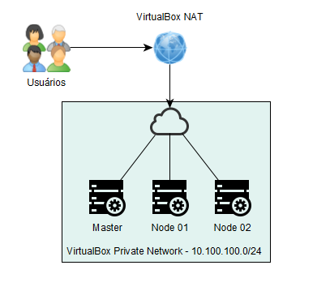

# Kubernetes On-premise - Hands On

Tutorial utilizado no *hands on* de **Kubernetes**.
O objetivo é realizar uma instalação básica de kubernetes sem a utilização
de ferramentas adicionais para a configuração do cluster. A idéia é
entender como as peças se encaixam na construção de um cluster.

### Pré-requisitos

Espera-se que o participante tenha realizado a verificação/configuração
dos pré-requisitos previamente à sua participação no *Hands On*.

* Computador
  * 6GB de ram +
  * Se você utiliza o computador no dia-a-dia, seu processador já é
    suficiente.
  * 20GB de disco para as VMs.
  * Interface de rede funcionando.

* Sistema operacional Windows/Linux compatível com VirtualBox.
  * Esse material foi desenvolvido em Windows mas deve funcionar sem
    maiores problemas em Linux.

* [VirtualBox 5.2.8](https://www.virtualbox.org/wiki/Downloads) ou
  superior.
  * Não testei em outras soluções. Pode ser necessário ajustar algum
    detalhe.

* [Vagrant 2.1](https://www.vagrantup.com/) ou superior.
  * O vagrant será utilizado apenas para a geração das máquinas virtuais,
  acelerando o processo de configuração do SO base utilizado nesse laboratório.
  A configuração dos componentes do Kubernetes é manual.

### Layout

Exemplificando a comunicação de rede entre os componentes do cluster.

---
### Índice
* [Componentes](arquivos/componentes.md)
* [Vagrant](arquivos/vagrant.md)
* [Referências](arquivos/referencias.md)
