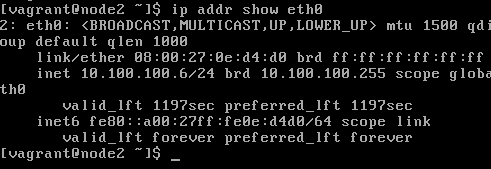

# Vagrant

Utilizaremos o Vagrant apenas para configuração do sistema operacional.
Definição de disco, memória e instalação do SO são itens que não
afetam diretamente esse laboratório e por isso passamos direto.

Para mais informações sobre o Vagrant ou sobre a estrutura do
Vagrantfile: [RTFM](https://www.vagrantup.com/docs/index.html).

#### Vagrantfile

O [arquivo](Vagrantfile) possui a configuração básica necessária
para configurar os 3 hosts apresentados no layout inicial.

Após a execução, será necessário um passo adicional de configuração.
Precisaremos alterar a rede do VirtualBox para permitir que todos os
hosts se comuniquem através do mesmo enlace virtual.

#### Iniciando o Vagrant
É necessário que o Vagrant já esteja instalado!

1 - Baixe o arquivo [Vagrantfile](Vagrantfile)

2 - Abra o terminal/shell, navegue até onde salvou o Vagrantfile e execute:
```bash
vagrant up
```
Aguarde o final da instalação:

```bash
    node2: Complete!
==> node2: Running provisioner: shell...
    node2: Running: inline script
==> node2: Running provisioner: shell...
    node2: Running: inline script
```

Além de configurar os hosts, o Vagrant também configura portas
de acesso (NAT), permitindo o SSH nos 3 hosts criados:

```
[quintiliano@Jhon arquivos]$ ss -natl | grep 70
LISTEN     0      10           *:7022
LISTEN     0      10           *:7023
LISTEN     0      10           *:7024
```

A relação de portas:

* Porta 7022 -> Master
* Porta 7023 -> Node 1
* Porta 7024 -> Node 2

**Importante**

Teste o acesso aos 3 hosts antes de continuar!

As credenciais de acesso padrão:
```
Usuário: vagrant
Senha:  vagrant
```
- Master: ```ssh vagrant@127.0.0.1 -p 7022```
- Node 1: ```ssh vagrant@127.0.0.1 -p 7023```
- Node 2: ```ssh vagrant@127.0.0.1 -p 7024```

Caso não funcione, verifique os passos realizados. O próximo passo
poderá deixar você trancado de fora caso não tenha verificado esse
acesso.

**Aproveite para desligar as 3 VMs!!**

#### Criar rede local!

O último passo é realizar a criação de uma rede local para permitir
a conexão direta entre as máquinas virtuais. Isso é feito direto no
VirtualBox:

- 1 - Selecione a opção **Arquivos (Files)** -> **Preferências (Preferences)**
- 2 - No menu apresentado, selecione a opção **Network**:


- 3 - No menu à esquerda, adicione uma nova rede chamada **k8s**.
A faixa de rede indicada é 10.100.100.0/24. Habilite a utilização do
DHCP.

    

#### Configurar o IP nos hosts!

Após criar a rede local, é necessário mover os três hosts criados
para a nova rede. Para isso, em cada um dos hosts, com o botão direito
selecione a opção **Configuração (Settings)** -> **Rede (Network)**:

    

- 1 - Configure as seguintes opções:
    - Conectado a (Attached to): Rede Nat (NAT Network)
    - Nome (Name): k8s
    - Altere o Endereço MAC (MAC Address) selecionando a opção azul
    no canto direto inferior. 
    - Marque a opção Cabo conectado (Cable Connected)
    
- 2 - Inicie os hosts novamente. Com a alteração do endereço, o acesso
por SSH não funcionará. Precisamos corrigir isso!

- 3 - Acesse cada host diretamente pelo painel do **VirtualBox** e 
verifique o novo IP de cada um.

    

    

    

No exemplo, os IPs obtidos são:

* Master -> 10.100.100.4
* Node 1 -> 10.100.100.5
* Node 2 -> 10.100.100.6

#### Configurar redirecionamento de portas

Com a lista de IPs obtidas, o último passo é configurar o redirecionamento
de portas para os hosts:

- 1 - Novamente no VirtualBox, novamente iremos editar a rede **k8s**.
    Em **Arquivo (File)** -> **Preferências (Preferences)** -> 
    **Rede (Network)** edite a rede k8s e selecione a opção 
    **Redirecionamento de portas (Port Forwarding)**. Remova qualquer
    regra existente antes de continuar:
    
    
    
- 2 - Crie as seguintes regras, substituindo os IPs caso necessário:

    
    
- 3 - Teste o acesso aos hosts através do SSH.  
    - Master: ```ssh vagrant@127.0.0.1 -p 7022```
    - Node 1: ```ssh vagrant@127.0.0.1 -p 7023```
    - Node 2: ```ssh vagrant@127.0.0.1 -p 7024```

- 4 - Teste a conexão entre os hosts. Um **ping** resolve!
    - Execute:
    
    ```bash
    [quintiliano@Jhon arquivos]$ ssh vagrant@127.0.0.1 -p 7022
    vagrant@127.0.0.1's password: 
    Last login: Tue Sep  4 02:18:31 2018 from 10.100.100.2
    [vagrant@master ~]$ ping 10.100.100.5
    PING 10.100.100.5 (10.100.100.5) 56(84) bytes of data.
    64 bytes from 10.100.100.5: icmp_seq=1 ttl=64 time=1.55 ms
    
    [vagrant@master ~]$ ping 10.100.100.6
    PING 10.100.100.6 (10.100.100.6) 56(84) bytes of data.
    64 bytes from 10.100.100.6: icmp_seq=1 ttl=64 time=1.63 ms 

    ``` 

**Sucesso!!** Com o teste de conexão finalizado, podemos começar
a instalar e configurar o **Kubernetes!**

Próximo: [Configurando os certificados](certificados.md)